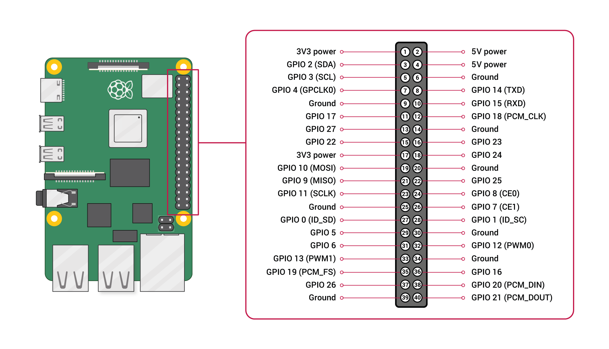

# acm-bot

This is a discord bot for the ACM chapter at SJSU. It links
the ACM door monitor to the ACM discord server, providing notifications
on the current room availability.

## Getting Started

First, make sure to install all the requirements. You can do so by running the following command
from the root of the repository:

```sh
pip install -r requirements.txt
```

From there, the project is divided into two services, the physical hardware monitor and the discord bot. They are currently tightly coupled,
and must be run on the same machine, although this may get changed in future versions.

### Physical Monitor

This requires the following variables:

```
DOOR_URL = <destination url to send door updates to>
DOOR_PORT = <destination port to send door updates to>
REFRESH_EVERY = <how often to send door status>
```

In order to run the monitor, simply run the below commands:

```sh
cd monitor
python3 main.py
```

### Discord Bot

This requires the following variables:

```
BOT_TOKEN = <Discord bot token>
MONITOR_LOG_LOCATION = </path/to/monitor.log>
```

In order to run the discord bot, simply run the below commands:

```sh
cd bot
python3 main.py
```

### Example

In total, your `.env` file, which should be placed in the root of this repository,
should look something like the following file:

```
BOT_TOKEN = MY_BOT_TOKEN
DOOR_URL = localhost
DOOR_PORT = 3000
REFRESH_EVERY = 1
MONITOR_LOG_LOCATION = /home/acmcs/acm-bot/monitor/monitor.log
```

## Contributing

This project uses a Cog and Extension setup. The purpose of using Cogs and
Extensions is to group related commands with each other and allow easy loading/reloading
of commands without having to restart the bot (sending `-reload (cog)` will reload the specified cog).

To add a cog, add a file in the directory `cogs`. The file should contain a class that
inherits from `commands.Cog` and a function `setup` that adds that cog to the Bot.

## Hardware Wiring Schematic

For the Raspberry Pi to be wired up correctly with the door sensors, the long wire
from the door sensor must be wired up to `GPIO 16`. The short wire from the door sensor must
be wired up to `GND`.

What this looks like in practice:

- door sensor's short wire &rarr; female to female connector &rarr; black extender wire &rarr; female to female connector &rarr;
  the `GND` pin on the Raspberry Pi (the 4th pin from the bottom on the right)
- door sensor's long wire &rarr; female to female connector &rarr; red extender wire &rarr; female to female connector &rarr;
  the `GPIO 16` pin on the Raspberry Pi (the 3rd pin from the bottom on the right)



## Raspi 5 setup

To set up the repository on a raspberry pi 5 to use a physical monitor, follow the below steps to get `gpiozero` in a venv.

- `sudo apt-get install python3-gpiozero`
- `source (venv)/bin/activate && pip install gpiozero`
- `cd (venv)/lib/python3.(tab)/site-packages`
- `ln -s /lib/python3/dist-packages/_lgpio(tab) .`
- `ln -s /lib/python3/dist-packages/lgpio.py .`

In order to add the services, simply run the following commands from the root of the repository:

```sh
cd ./services
# make the startup files executable
chmod +x discordbotservice.sh
chmod +x monitorservice.sh
# symlink the service files
sudo ln -s /home/acmcs/acm-bot/services/discordbot.service /etc/systemd/system/
sudo ln -s /home/acmcs/acm-bot/services/monitor.service /etc/systemd/system/
# enable services
sudo systemctl enable discordbot
sudo systemctl enable monitor
```

Note that this assumes that you have cloned the repository in the home directory and that the user is `acmcs`.
